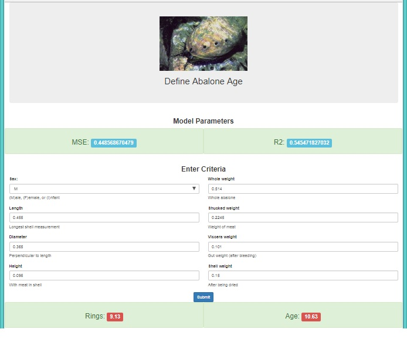

# Predicting the age of abalone from physical measurements.

 Abalone is a shellfish considered a delicacy in many parts of the world. An excellent source of iron and pantothenic acid, and a nutritious food resource and farming in Australia, America and East Asia.

 The economic value of abalone is positively correlated with its age. Therefore, to detect the age of abalone accurately is important for both farmers and customers to determine its price. 

 The age of abalone is determined by cutting the shell through the cone, staining it, and counting the number of rings through a microscope -- a boring and time-consuming task. Other measurements (length, diameter, weight, height, sex), which are easier to obtain, are used to predict the age.

### Tools used: 
Python Pandas, Matplotlib, Scikit-learn, Flask, HTML.

### Data Set Information:
https://archive.ics.uci.edu/ml/datasets/Abalone

